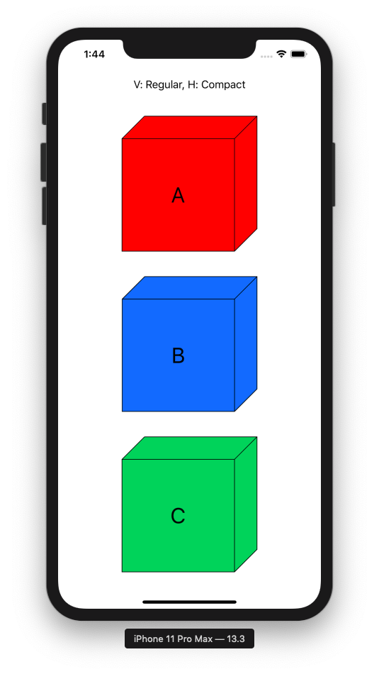
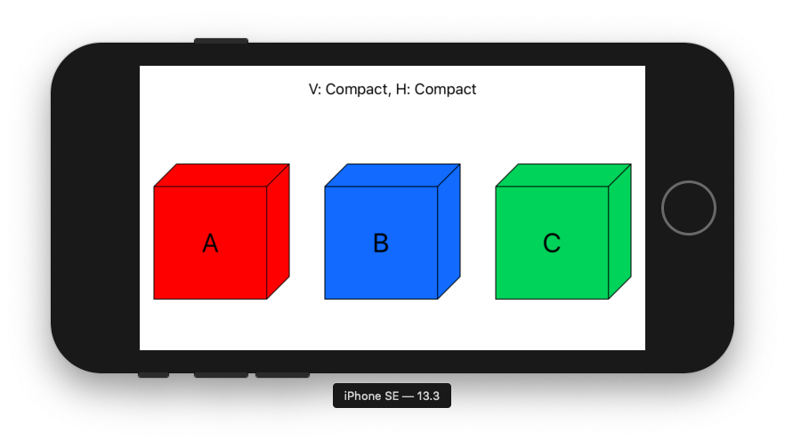
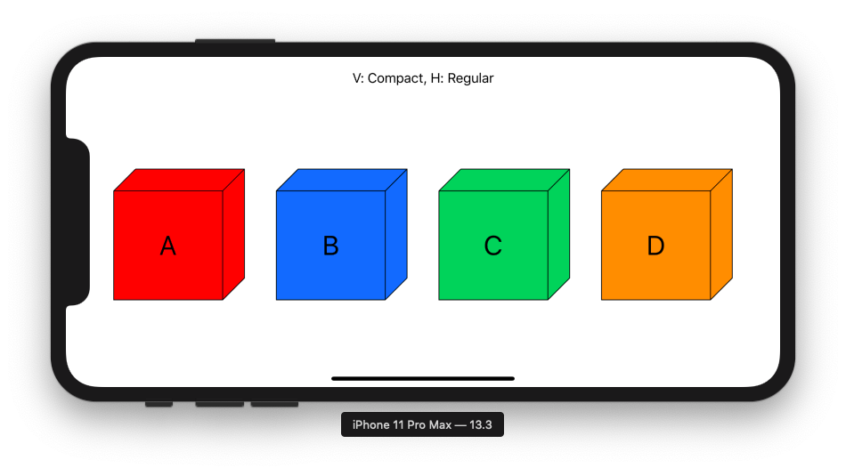
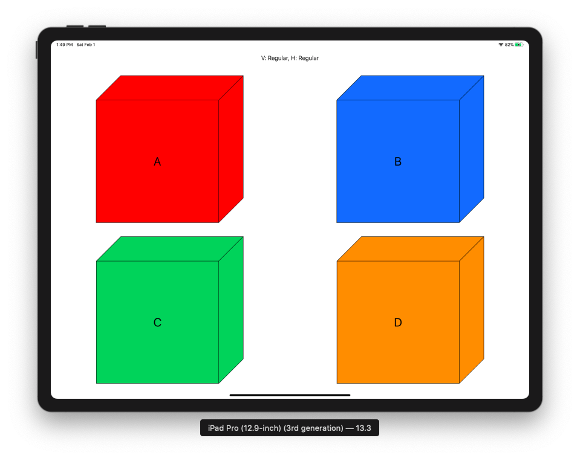
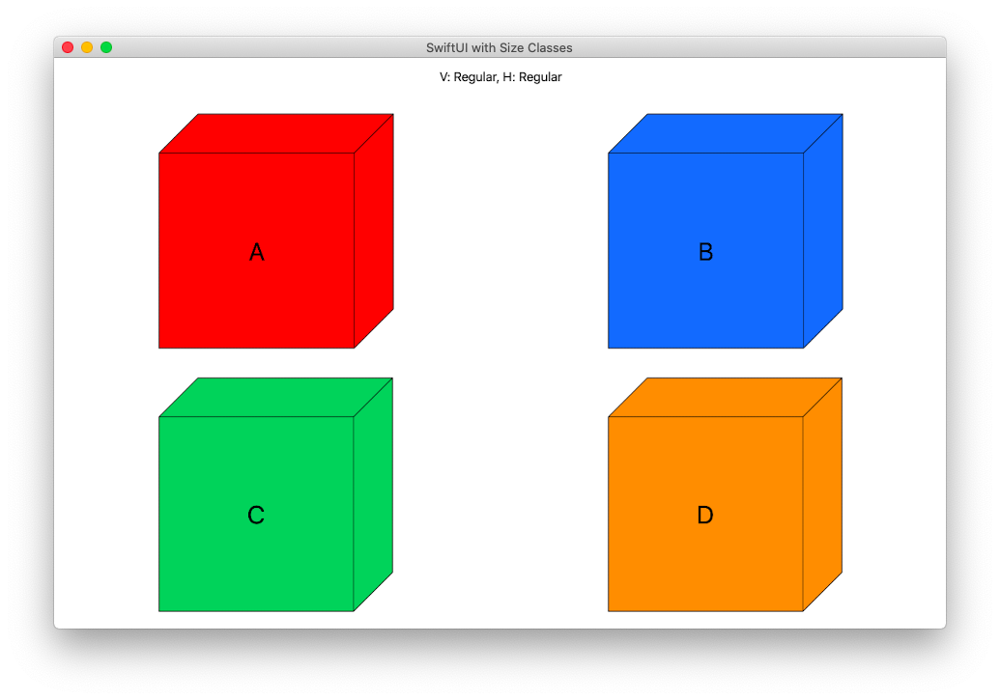

# SwiftUI with Size Classes

## Vertical Regular, Horizontal Compact. E.g. iPhone Portrait and iPad 1/3 split view for Multitasking

```swift
if verticalSizeClass == .regular && horizontalSizeClass == .compact {
    // iPhone Portrait or iPad 1/3 split view for Multitasking for instance
    // A
    // B
    // C
    VStack {
        Text("V: Regular, H: Compact").padding()
        Spacer()
        VStack {
            CubeView(letter: "A").padding()
            CubeView(letter: "B").padding()
            CubeView(letter: "C").padding()
        }
        Spacer()
    }
}
```



## Vertical Compact, Horizontal Compact. E.g. "Standard" iPhone Landscape

```swift
if verticalSizeClass == .compact && horizontalSizeClass == .compact {
    // some "standard" iPhone Landscape (iPhone SE, X, XS, 7, 8, ...)
    // A B C
    VStack {
        Text("V: Compact, H: Compact").padding()
        Spacer()
        HStack {
            CubeView(letter: "A").padding()
            CubeView(letter: "B").padding()
            CubeView(letter: "C").padding()
        }
        Spacer()
    }
}
```


## Vertical Compact, Horizontal Regular. E.g. "Bigger" iPhone Landscape

```swift
if verticalSizeClass == .compact && horizontalSizeClass == .regular {
    // some "bigger" iPhone Landscape (iPhone Xs Max, 6s Plus, 7 Plus, 8 Plus, ...)
    // A B C D
    VStack {
        Text("V: Compact, H: Regular").padding()
        Spacer()
        HStack {
            CubeView(letter: "A").padding()
            CubeView(letter: "B").padding()
            CubeView(letter: "C").padding()
            CubeView(letter: "D").padding()
        }
        Spacer()
    }
}
```


## Vertical Regular, Horizontal Regular. E.g. iPad fullscreen, iPad 1/2 split view, macOS

```swift
if verticalSizeClass == .regular && horizontalSizeClass == .regular {
    // macOS or iPad without split view - no Multitasking
    // A B
    // C D
    VStack {
        Text("V: Regular, H: Regular").padding()
        Spacer()
        HStack {
            CubeView(letter: "A").padding()
            CubeView(letter: "B").padding()
        }
        HStack {
            CubeView(letter: "C").padding()
            CubeView(letter: "D").padding()
        }
        Spacer()
    }
}
```


